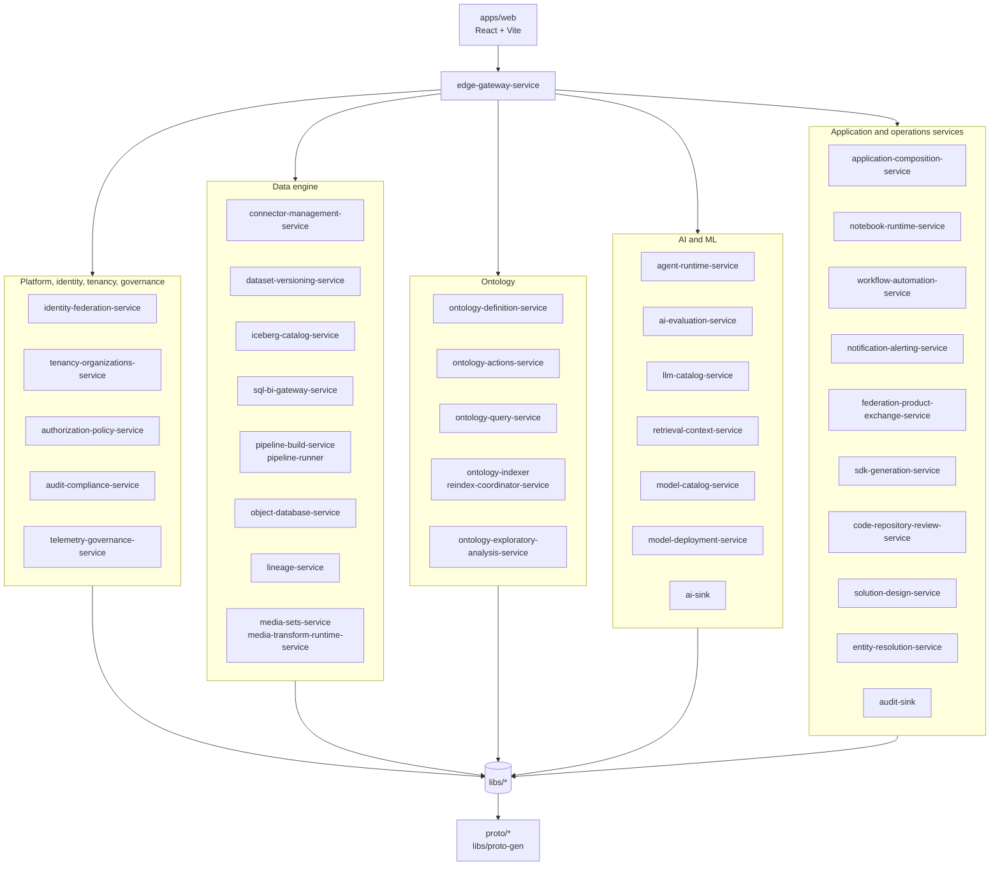

# OpenFoundry Architecture

The canonical technical documentation for this repository lives in
[`docs/`](docs/). This file is a compact architecture entry point that reflects
the active source tree as of 2026-05-08.

## Current monorepo shape

OpenFoundry is a Go-first platform monorepo with these active source surfaces:

- `services/`: 41 Go service directories. Each service owns a bounded runtime
  context and generally exposes one binary under `cmd/<service-name>/main.go`.
  `workflow-automation-service` also includes an `approvals-timeout-sweep`
  command.
- `libs/`: 32 shared Go packages for common models, auth, Cedar authorization,
  observability, eventing, reliability primitives, domain kernels, storage and
  search abstractions, AI/ML helpers, generated protobufs, and tests.
- `apps/web`: the React 19 + Vite product frontend.
- `proto/`: canonical protobuf contracts; generated Go output is committed under
  `libs/proto-gen`.
- `sdks/`: generated SDK packages and package metadata.
- `python/`: Python runtime support for sidecar/runtime flows.
- `infra/`: Compose, Helm, Terraform, observability, and operational assets.
- `docs/`: the VitePress technical documentation site.

Historical Rust/parity documents still exist for migration traceability. Treat
those documents as historical unless they explicitly say they describe the live
Go source tree.

## High-level runtime view

## Architectural boundaries

- **Edge and platform controls.** `edge-gateway-service` is the HTTP entry point
  for service routing. Identity, tenancy, and authorization are handled by the
  identity, tenancy, authorization-policy, auth middleware, and Cedar helper
  packages.
- **Data engine.** Connector, dataset, Iceberg, SQL/BI, pipeline, object,
  lineage, and media services make up the data-plane runtime.
- **Ontology.** Ontology definition, actions, query, indexing, exploratory
  analysis, and shared ontology-kernel code own the semantic layer.
- **AI/ML.** Agent runtime, LLM catalog, retrieval context, evaluation, model
  catalog/deployment, and AI event sink services make up the AI/ML runtime.
- **Application and operations services.** Application composition, notebooks,
  workflows, notifications, federation, SDK generation, code review, solution
  design, entity resolution, audit compliance, audit sink, and telemetry support
  product delivery and operations.
- **Contracts and generated clients.** Protobuf contracts in `proto/`, generated
  Go protobufs in `libs/proto-gen`, OpenAPI artifacts under
  `apps/web/public/generated/openapi`, and SDK packages under `sdks/` must be
  reviewed together when public contract shape changes.

## Contributor entry points

- Monorepo map: [`docs/guide/repository-map.md`](docs/guide/repository-map.md)
- Detailed layout reference:
  [`docs/reference/repository-layout.md`](docs/reference/repository-layout.md)
- Architecture center: [`docs/architecture/index.md`](docs/architecture/index.md)
- Local development: [`docs/guide/local-development.md`](docs/guide/local-development.md)
- Quality gates: [`docs/guide/quality-gates.md`](docs/guide/quality-gates.md)
- Operations and delivery: [`docs/operations/index.md`](docs/operations/index.md)

## Operating principles

- Prefer the live source tree over migration-era notes when documentation and
  code disagree.
- Keep backend changes inside the single root Go module unless there is an
  explicit architecture decision to split a package or service.
- Reuse shared packages in `libs/` before adding service-local duplicate logic.
- Update protobuf, generated artifacts, SDKs, frontend consumers, and docs in
  the same change when a public contract changes.
- Keep service-family documentation aligned with actual directories and command
  names so onboarding docs remain executable.
