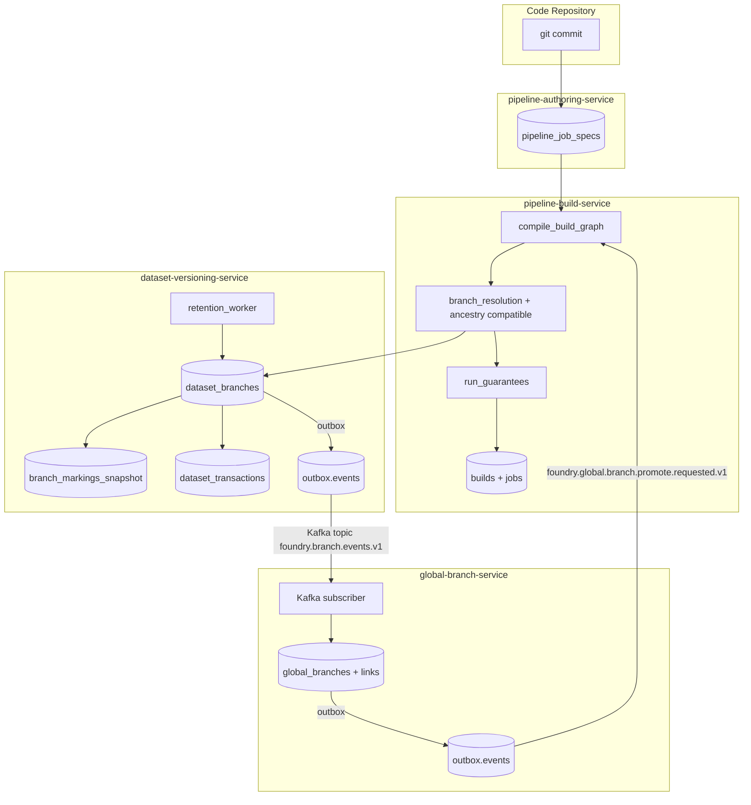

# ADR-0033 — Branching: Foundry parity

## Status

Accepted (D1.1.4 — 5/5).

## Context

Foundry's branching model spans datasets, pipelines, ontology, and
the Code Repos plane. The doc surface is split across:

  * [Data connectivity & integration / Core concepts / Branching](../../../docs_original_palantir_foundry/foundry-docs/Data%20connectivity%20%26%20integration/Core%20concepts/Branching.md)
  * [Data connectivity & integration / Workflows / Building pipelines / Best practices / Branching and release process](../../../docs_original_palantir_foundry/foundry-docs/Data%20connectivity%20%26%20integration/Workflows/Building%20pipelines/Best%20practices/Branching%20and%20release%20process.md)
  * [Developer toolchain / Functionality / Global Branching/*](../../../docs_original_palantir_foundry/foundry-docs/Developer%20toolchain/Functionality/Global%20Branching)

We needed parity across five axes:

  1. **Dataset branches** with transactions, fallback chains and the
     "one open transaction" guarantee.
  2. **JobSpec publishing + build branch resolution** spanning the
     pipeline planes.
  3. **UI** for branch graph, comparison, lifecycle, JobSpec
     icon coloring, and the open-transaction banner.
  4. **Retention + markings inheritance** with snapshot semantics.
  5. **Global branching** that coordinates branches across planes.

## Architecture

## Decisions

### D1. Markings inheritance — snapshot semantics, no late propagation

When a child branch is created, the parent's effective markings are
copied into `branch_markings_snapshot` with `source = PARENT`. If the
parent later gains a new marking, the **child does not inherit it**.
Rationale: Foundry's "Branch security" doc and the "Best practices
and technical details" companion both warn against retroactive
clearance escalation — a parent owner could otherwise raise the
floor on every descendant without their consent. The snapshot is the
audit point.

Implementation:
[branch_markings_snapshot](../../services/dataset-versioning-service/migrations/20260504000030_branch_retention.sql)
+ [branch_markings.rs](../../services/dataset-versioning-service/src/domain/branch_markings.rs)
+ test [branch_markings_snapshot_at_creation.rs](../../services/dataset-versioning-service/tests/branch_markings_snapshot_at_creation.rs).

### D2. DELETE preserves transactions

`DELETE /v1/datasets/{rid}/branches/{branch}` flips
`deleted_at = NOW()` and reparents children, but leaves every
`dataset_transactions` row intact. The Foundry doc § "Dataset branch
guarantees" explicitly notes that "transactions are not deleted; only
the pointer". Soft-delete keeps the audit trail and lets a future
admin re-create a branch with the same name from any historical
transaction id.

Implementation: [delete_branch + preview_delete_branch](../../services/dataset-versioning-service/src/handlers/foundry.rs).

### D3. Per-input fallback chain (not boolean `fallback_enabled`)

Pipeline JobSpecs declare each input as `{ input, fallback_chain: [...] }`
instead of the legacy `{ input, fallback_enabled: bool }`. The chain
is the canonical Foundry primitive (`feature → develop → master`
walks per-input independently of the build's global JobSpec
fallback). A backwards-compat shim translates `fallback_enabled =
true → ["master"]`.

Implementation:
[JobSpecInput / JobSpecInputCompat](../../services/pipeline-authoring-service/src/models/job_spec.rs)
+ [resolve_input_dataset](../../services/pipeline-build-service/src/domain/branch_resolution.rs).

### D4. JobSpec publishing is first-class

Code-Repo commits publish a JobSpec per output dataset on the commit
branch. `pipeline_job_specs` is the source of truth; the build
service walks `[build_branch, …job_spec_fallback]` per output to
compile its graph. Republishing the same content on the same key is
idempotent (no-op); changing it bumps `version`.

Implementation:
[pipeline_job_specs migration](../../services/pipeline-authoring-service/migrations/20260504000020_job_specs.sql)
+ [publish_job_spec](../../services/pipeline-authoring-service/src/handlers/job_specs.rs)
+ [compile_build_graph](../../services/pipeline-build-service/src/domain/job_graph.rs).

### D5. Ancestry-compatibility guard on the fallback chain

The doc's "Build branch guarantees" line — *"Build resolution only
succeeds if the specified branch fallback sequence is compatible with
the branch ancestries in the involved datasets"* — is encoded as a
pure assertion on the per-dataset ancestry walk
([assert_chain_ancestry_compatible](../../services/pipeline-build-service/src/domain/branch_resolution.rs)).

### D6. Outbox-only publication, no direct Kafka producer

Every branch lifecycle change goes through
`outbox::enqueue` inside the same Postgres transaction as the SQL
mutation. Debezium's WAL reader picks it up and routes to the
`foundry.branch.events.v1` topic. Direct producers would lose the
atomic guarantee. global-branch-service uses the same pattern for
the promote event.

## Foundry parity matrix

Section-by-section status against the canonical Foundry docs.

### Dataset branches (Branching.md § "Dataset branches")

| Doc claim | Status | Evidence |
|-----------|--------|----------|
| "Branches are pointers to transactions." | ✅ | `dataset_branches.head_transaction_id` ([migration](../../services/dataset-versioning-service/migrations/20260501000001_versioning_init.sql)) |
| "Every branch has at most one open transaction." | ✅ | Partial unique index `uq_dataset_transactions_one_open_per_branch` |
| "Create child branch from another branch OR from any transaction." | ✅ | `BranchSource { from_branch | from_transaction_rid | as_root }` |
| "Re-parenting only changes ancestry, never transactions." | ✅ | [reparent_branch](../../services/dataset-versioning-service/src/storage/runtime.rs) + [test](../../services/dataset-versioning-service/tests/branches_create_and_reparent.rs) |
| "Delete preserves transactions." | ✅ | D2; `delete_branch` flips `deleted_at` only |
| "Fallback chain per branch." | ✅ | `fallback_chain TEXT[]` + `dataset_branch_fallbacks` |
| Ancestry walk (`/branches/{branch}/ancestry`) | ✅ | [list_branch_ancestry](../../services/dataset-versioning-service/src/storage/runtime.rs) |

### Branches in builds (Branching.md § "Branches in builds")

| Doc claim | Status | Evidence |
|-----------|--------|----------|
| "JobSpecs are stored per branch." | ✅ | `pipeline_job_specs` |
| "Compilation walks the JobSpec fallback chain." | ✅ | [compile_build_graph](../../services/pipeline-build-service/src/domain/job_graph.rs) |
| "Inputs use per-input fallback." | ✅ | D3 |
| "Output transaction lands on the build branch." | ✅ | [run_guarantees::assert_transaction_targets_build_branch](../../services/pipeline-build-service/src/domain/run_guarantees.rs) |
| "A build never creates branches on input datasets." | ✅ | [run_guarantees::assert_input_dataset_not_branched](../../services/pipeline-build-service/src/domain/run_guarantees.rs) |
| "Compatibility check vs branch ancestries." | ✅ | D5 |
| Dry-run resolve (Pipeline Builder preview) | ✅ | `POST /pipelines/{rid}/dry-run-resolve` |

### Branch retention (Global Branching / Usage / Branch retention)

| Doc claim | Status | Evidence |
|-----------|--------|----------|
| `INHERITED` walks parent chain. | ✅ | [retention::resolve_effective_retention](../../services/dataset-versioning-service/src/domain/retention.rs) |
| `FOREVER` opts out. | ✅ | Default for `master` |
| `TTL_DAYS` archives stale non-root branches. | ✅ | [retention_worker::run_once](../../services/dataset-versioning-service/src/domain/retention_worker.rs) |
| Restore within grace window. | ✅ | `POST /branches/{branch}:restore` |
| Manual override via PATCH endpoint. | ✅ | `PATCH /branches/{branch}/retention` |

### Branch security (Global Branching / Core concepts / Branch security)

| Doc claim | Status | Evidence |
|-----------|--------|----------|
| Markings inherit at child creation. | ✅ | D1 |
| Late-added parent markings do NOT propagate. | ✅ | D1 + dedicated test |
| Effective = explicit ∪ inherited. | ✅ | `BranchMarkingsView::from_rows` |
| UI surfaces explicit vs inherited. | ✅ | `routes/datasets/[id]/branches/[branch]/+page.svelte` |

### Global Branching application (Developer toolchain / Functionality / Global Branching)

| Doc claim | Status | Evidence |
|-----------|--------|----------|
| Cross-plane workstream label. | ✅ | `global_branches` table |
| Per-resource link with status. | ✅ | `global_branch_resource_links` |
| Auto-link via `global_branch=<rid>` event label. | ✅ | [PostgresSubscriber](../../services/global-branch-service/src/global/subscriber.rs) |
| Promote emits cross-plane request. | ✅ | `POST /global-branches/{id}/promote` |
| Workshop rebase / conflict resolver UI. | 🟡 | Partial (BranchCompare surfaces conflicts; rebase-merge UX deferred) |

### Branching lifecycle (Global Branching / Usage / Branching lifecycle)

| Doc claim | Status | Evidence |
|-----------|--------|----------|
| Lifecycle visualisation. | ✅ | `BranchLifecycleTimeline.svelte` |
| Audit trail per branch action. | ✅ | `branch.created/.deleted/.archived/.restored/...` events |
| Outbox guarantees ordering. | ✅ | D6 |

### Branching functions (Global Branching / Usage / Branching functions)

| Doc claim | Status | Evidence |
|-----------|--------|----------|
| `current_branch()` etc. context functions. | 🟡 | Out of scope for D1.1.4 — tracked separately |

## Consequences

* Producers across planes (datasets, pipelines, future ontology
  branches) must publish onto the same `foundry.branch.events.v1`
  topic and use the canonical envelope shape.
* Re-parenting a branch never moves transactions or commits, so no
  rewrite/log replay path is needed in catch-up consumers.
* The retention worker is in-process inside `dataset-versioning-service`;
  if it grows beyond a single shard's worth of branches we'll split
  it into a dedicated `branch-retention-worker` service.

## References

* [Foundry Branching doc](../../../docs_original_palantir_foundry/foundry-docs/Data%20connectivity%20%26%20integration/Core%20concepts/Branching.md)
* [Branching and release process](../../../docs_original_palantir_foundry/foundry-docs/Data%20connectivity%20%26%20integration/Workflows/Building%20pipelines/Best%20practices/Branching%20and%20release%20process.md)
* [Global Branching application](../../../docs_original_palantir_foundry/foundry-docs/Developer%20toolchain/Functionality/Global%20Branching)
