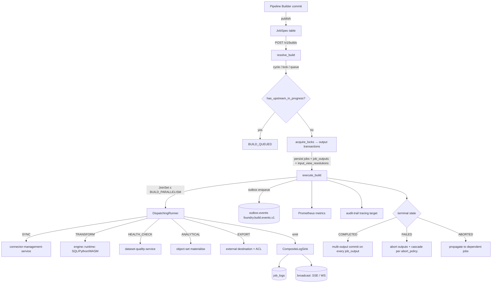

# ADR-0036 — Builds: Foundry parity

- **Status**: Accepted
- **Date**: 2026-05-03
- **Owners**: pipeline-build-service maintainers
- **Supersedes**: parts of `ADR-0034-datasets-foundry-parity.md` that referenced
  the legacy `pipeline_runs.status` free-form column.
- **Related**:
  [ADR-0033 Branching parity](ADR-0033-branching-foundry-parity.md),
  [Builds.md](../../../docs_original_palantir_foundry/foundry-docs/Data%20connectivity%20%26%20integration/Core%20concepts/Builds.md).

## Context

Foundry's "Builds" application is the orchestration centre of the data
plane: every dataset version is the output of a build, every build is a
graph of jobs, and every job is a kind-specific runner emitting live
logs into a streaming UI. Pre-D1.1.5 OpenFoundry only modelled the
`TRANSFORM` job kind via a free-form `pipeline_runs.status` column with
no formal lifecycle, no resolver, no parallel orchestrator and no live
logs.

This ADR captures the architectural decisions that close the parity
gap (D1.1.5 P1 → P5). It is the source of truth for the contracts that
external consumers (UI, CLI, audit, lineage) depend on.

## Architecture



## State machines

### `BuildState`

```text
BUILD_RESOLUTION ──┬─→ BUILD_QUEUED ─→ BUILD_RESOLUTION   (re-attempt)
                   └─→ BUILD_RUNNING ─┬─→ BUILD_COMPLETED
                                       ├─→ BUILD_FAILED
                                       └─→ BUILD_ABORTING ─→ BUILD_ABORTED
```

### `JobState` (Foundry vocabulary verbatim)

```text
WAITING ──┬─→ RUN_PENDING ─→ RUNNING ─┬─→ COMPLETED
          │                            ├─→ FAILED
          │                            └─→ ABORT_PENDING ─→ ABORTED
          └────────────────────────────→ ABORTED        (cascading abort)
```

Implementation: [`domain::job_lifecycle::is_valid_transition`](../../../services/pipeline-build-service/src/domain/job_lifecycle.rs).

## Decisions

### 1 — Build queueing on input contention

Builds whose input datasets are being produced by another in-progress
build short-circuit to `BUILD_QUEUED` instead of acquiring locks. This
matches the doc's *"the build may be queued and wait for the other
build to complete"* and sidesteps the dataset-versioning service from
having to expose a wait-on-input primitive. The poller in
`pipeline-schedule-service` is responsible for re-resolving queued
builds when their upstream finishes.

### 2 — Live logs intentional 10-second delay

Per doc: *"Once enabled, a ten-second delay may occur before the live
logs are visible in the interface."* The SSE handler emits `event:
heartbeat` records during the delay so the UI shows a counting
"Initializing — logs will appear in ~Ns" badge, mirroring Foundry's
behaviour. Removing this delay is an explicit non-decision: keep it.

### 3 — Staleness signature

A job is *fresh* iff:

- `JobSpec.content_hash` (canonical hash of inputs + logic_payload at
  publish time) matches the previous COMPLETED job's
  `canonical_logic_hash`, AND
- `input_signature(resolved_input_views)` matches the previous job's
  `input_signature`.

Both signatures are stored on `jobs` so subsequent builds can compare
without re-executing the runner. `force_build = true` short-circuits
the check entirely (Foundry doc § Staleness).

Implementation: [`domain::staleness`](../../../services/pipeline-build-service/src/domain/staleness.rs).

### 4 — Failure cascade default

Default `abort_policy = DEPENDENT_ONLY` (Foundry doc default). When a
job fails, only its transitive dependents are aborted; independent
jobs continue. `ALL_NON_DEPENDENT` is the explicit opt-in for "stop
the world on first failure".

### 5 — Multi-output atomicity

A JobSpec with N outputs commits *all* output transactions or none.
The `job_outputs` table tracks `committed`/`aborted` per output; on
partial commit failure the executor aborts the still-open outputs and
marks the job FAILED. This honours the doc's invariant that *"if a
job defines multiple output datasets, they will always update
together"*.

## Foundry parity matrix

| Foundry section | OpenFoundry artefact | Status |
| --- | --- | --- |
| **Builds** (overview) | `services/pipeline-build-service/src/handlers/builds_v1.rs` | ✅ |
| Jobs and JobSpecs | `domain::build_resolution::JobSpec`, `domain::runners::*` | ✅ |
| § Job states (`WAITING`/.../`COMPLETED`) | `models::job::JobState` | ✅ |
| § Build resolution | `domain::build_resolution::resolve_build` | ✅ |
| § Job execution (parallel, cascade) | `domain::build_executor::execute_build` | ✅ |
| § Staleness + force build | `domain::staleness::is_fresh` | ✅ |
| § Live logs (color, pause, JSON, 10s delay) | `domain::logs::*`, `apps/web/src/lib/components/pipeline/LiveLogViewer.svelte` | ✅ |
| § Branching in builds | `domain::branch_resolution::resolve_input_dataset/output_dataset` | ✅ |
| Sync logic kind | `domain::runners::sync::SyncJobRunner` | ✅ |
| Transform logic kind | `domain::runners::transform::TransformJobRunner` (engine integration deferred) | 🟡 |
| Health-check logic kind | `domain::runners::health_check::HealthCheckJobRunner` | ✅ |
| Analytical logic kind | `domain::runners::analytical::AnalyticalJobRunner` | ✅ |
| Export logic kind | `domain::runners::export::ExportJobRunner` | ✅ |
| Application reference § Builds | `apps/web/src/routes/builds/+page.svelte`, `[rid]/+page.svelte` | ✅ |
| Health checks FAQ | `services/dataset-quality-service` (POST /v1/datasets/{rid}/health-checks/results, contract owner) | 🟡 |

## Consequences

- All cross-service consumers must move from the legacy
  `pipeline_runs.status` free-form column to the typed
  `BuildState`/`JobState` enums. The migration is
  `20260504000050_builds_init.sql` (P1).
- Outbox topic `foundry.build.events.v1` is the canonical event feed
  for downstream consumers (audit, lineage, dashboards). The eight
  event names are pinned in `domain::build_events`.
- The 10-second live-log delay is part of the contract — UI and
  client SDKs must render the heartbeat phase explicitly.
