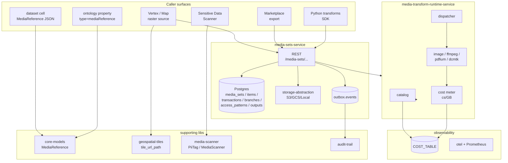

# ADR-0039 — Media sets architecture (Foundry parity)

## Status

Accepted (D1.1.3 — 5/5).

## Context

Foundry's media-set surface is the typed, governed, billable home for
unstructured artifacts (images, audio, video, documents, spreadsheets,
emails, DICOM imagery). It threads through datasets, ontology
properties, the Map / Vertex apps, the Sensitive Data Scanner, the
Marketplace, and the transforms toolchain. The Foundry doc surface
spans:

  * [Data integration / Media sets / Add a DICOM media set](../../../docs_original_palantir_foundry/foundry-docs/Data%20integration/Media%20sets/Add%20a%20DICOM%20media%20set.md)
  * [Data integration / Media sets / Transcribe an audio media set](../../../docs_original_palantir_foundry/foundry-docs/Data%20integration/Media%20sets/Transcribe%20an%20audio%20media%20set.md)
  * [Data integration / Media sets / Use media sets with Python transforms](../../../docs_original_palantir_foundry/foundry-docs/Data%20integration/Media%20sets/Use%20media%20sets%20with%20Python%20transforms.md)
  * [Data integration / Media sets / Media set transforms API reference](../../../docs_original_palantir_foundry/foundry-docs/Data%20integration/Media%20sets/Media%20set%20transforms%20API%20reference.md)
  * [Data integration / Media sets / Incremental media sets](../../../docs_original_palantir_foundry/foundry-docs/Data%20integration/Media%20sets/Incremental%20media%20sets.md)
  * [Data integration / Media sets / Media usage costs and limits](../../../docs_original_palantir_foundry/foundry-docs/Data%20integration/Media%20sets/Media%20usage%20costs%20and%20limits.md)
  * [Vertex / Media layers and image annotations](../../../docs_original_palantir_foundry/foundry-docs/Vertex/Media%20layers%20and%20image%20annotations.md)
  * [SDS / Media set scanning](../../../docs_original_palantir_foundry/foundry-docs/Sensitive%20Data%20Scanner/Media%20set%20scanning.md)
  * [Marketplace / Build a product / Add packaged resources](../../../docs_original_palantir_foundry/foundry-docs/Marketplace/Build%20a%20product/Add%20packaged%20resources.md)

Closing parity required eight axes:

  1. **Storage**: bytes in object storage; metadata + transactions in
     Postgres.
  2. **Schemas**: 7 first-class kinds (`IMAGE`, `AUDIO`, `VIDEO`,
     `DOCUMENT`, `SPREADSHEET`, `EMAIL`, `DICOM`).
  3. **Transactions**: TRANSACTIONLESS vs. TRANSACTIONAL with
     write-mode `modify` (default) vs. `replace` (rejected on
     transactionless), one open transaction per branch, 10k items per
     transaction.
  4. **Branches**: `parent_branch_rid`, `head_transaction_rid`,
     fallback chains, merge resolution.
  5. **Access patterns**: `RECOMPUTE`, `PERSIST`, `CACHE_TTL` against
     the doc-canonical key list (thumbnail, ocr, geo_tile,
     render_dicom_image_layer, transcription, …).
  6. **Cost meter**: every key billed at the doc rate (cs/GB) with a
     ledger row per invocation distinguishing miss vs. hit.
  7. **Governance**: Cedar engine + markings inheritance, audit
     envelope on every upload/download/delete routed through the
     outbox to `audit.events.v1`.
  8. **Ecosystem**: MediaReference as a first-class ontology property;
     Vertex / Map raster sources; SDS scanner; Marketplace export;
     Python incremental transforms.

## Architecture



## Decision

### Storage + transactions

* Bytes live in `storage-abstraction` (S3/GCS/Local). Metadata is
  Postgres-backed. The `MediaItem` row carries `transaction_rid` (NULL
  for transactionless writes) so a single SQL query can list
  current/previous/added items.
* TRANSACTIONLESS sets reject `write_mode = replace`; the
  `MediaError::TransactionlessRejectsReplace` shape is the canonical
  rejection on the SDK boundary too (Python
  `MediaSetWriteModeError`).
* TRANSACTIONAL sets enforce one open transaction per branch via a
  partial unique index, capped at 10k items per transaction.

### Schemas

* `core_models::MediaSetSchema` enumerates the 7 doc-canonical kinds.
  Wire-form is `SCREAMING_SNAKE_CASE`; the same shape lives in the
  service-local enum and in the Postgres CHECK constraint
  (migration 0008 added DICOM).
* `MediaReference` is the typed pointer that travels in dataset cells
  and ontology property values:
  ```json
  {"mediaSetRid":"...","mediaItemRid":"...","branch":"main","schema":"DICOM"}
  ```

### Branches

* Branches are typed `(media_set_rid, name)` rows with
  `parent_branch_rid` and `head_transaction_rid`, generated `branch_rid`
  via `md5(media_set_rid + name)`.
* Merge resolution is "latest wins" by default with explicit conflict
  surfacing on shared paths.

### Access patterns

* Every Foundry-published key in the cost table maps to a
  `media-transform-runtime-service` catalog row with a status:
  `Native` / `External { binary }` / `NotImplemented { reason }`.
* Three persistence policies — `RECOMPUTE` (charge every call),
  `PERSIST` (one-shot derive + serve from cache forever), `CACHE_TTL`
  (recharge after TTL expiry).
* DICOM gets a dedicated key (`render_dicom_image_layer`, 75 cs/GB)
  catalogued as `External { binary: "dcmtk" }`.

### Cost meter

* `observability::COST_TABLE` is the verbatim doc mirror; the snapshot
  test in
  `services/media-sets-service/tests/cost_model_matches_table.rs`
  pins it row-by-row.
* Compute-seconds rounds up, so a 1-byte invocation still incurs at
  least 1 cs.
* Ledger rows in `media_set_access_pattern_invocations` distinguish
  miss vs. hit so cache hits never double-charge.

### Governance

* Cedar engine seeded with default media-set policies; markings travel
  on the set + each item; clearances live in the JWT scope.
* Every upload/download/delete emits an audit envelope through the
  outbox to `audit.events.v1`.

### Ecosystem

* Vertex / Map raster source: `geospatial-tiles` lib owns the
  doc-canonical `/tiles/{rid}/{z}/{x}/{y}.png` shape and a MapLibre
  raster-source descriptor; the front-end mounts it via
  `<RasterMediaLayer>`.
* SDS: `media-scanner` lib carries the `PiiTag` taxonomy + the
  `MediaScanner` trait; the production runtime plugs in to call
  `media-transform-runtime-service`'s `doc_ocr` access pattern. The
  trait is dispatcher-friendly (per-tenant `quota_remaining`).
* Marketplace: `MarketplaceArtifact::MediaSet { media_set,
  access_patterns, sync, markings }` and `PackageType::MediaSet`
  ("media_set") let curators publish a media set with all its
  registered access patterns + the source markings; the importer
  re-applies them after the rid remap.
* Python transforms: `openfoundry_transforms.transform` +
  `incremental` mirror Foundry's `transforms.api`. The SDK ships with
  an `InMemoryMediaSetBackend` that snapshots inputs after every
  successful run so build #N+1's `mode="added"` listing reflects the
  post-build baseline.

## Consequences

* Adding a new schema is a 4-line change (core-models enum + service
  enum + cost-table row + migration); the contract tests catch every
  drift.
* Cost-table drift is impossible without a code change: the
  `cost_model_matches_table.rs` snapshot enforces row-by-row equality
  with the Foundry doc.
* Adding a new access pattern is a catalog row + (optionally) a worker
  handler. The catalog's `every_catalog_key_has_a_cost_row` unit test
  rejects orphan handlers; the cost-table snapshot rejects orphan
  rates.
* New consumer surfaces (Vertex, Map, SDS, Marketplace, Python) plug
  in against narrow lib boundaries (`geospatial-tiles`,
  `media-scanner`, `marketplace-service` artifact enum,
  `openfoundry_transforms`) — none of them have to import the
  full media-sets-service surface.

## References

* Cost-table snapshot: `services/media-sets-service/tests/cost_model_matches_table.rs`
* Named integration tests (H7 closure):
  * `services/media-sets-service/tests/dicom_media_set_render_layer.rs`
  * `services/media-sets-service/tests/vertex_media_layer_geo_tiling.rs`
  * `services/media-sets-service/tests/sds_scan_finds_pii_in_pdf_ocr.rs`
  * `services/media-sets-service/tests/marketplace_export_imports_media_set_with_access_patterns.rs`
  * `services/media-sets-service/tests/empty_media_set_round_trip.rs`
  * `sdks/python/openfoundry_transforms/tests/python_incremental_media_transform_replace_mode.py`
* Doc mirror: `docs_original_palantir_foundry/foundry-docs/Data integration/Media sets/`
