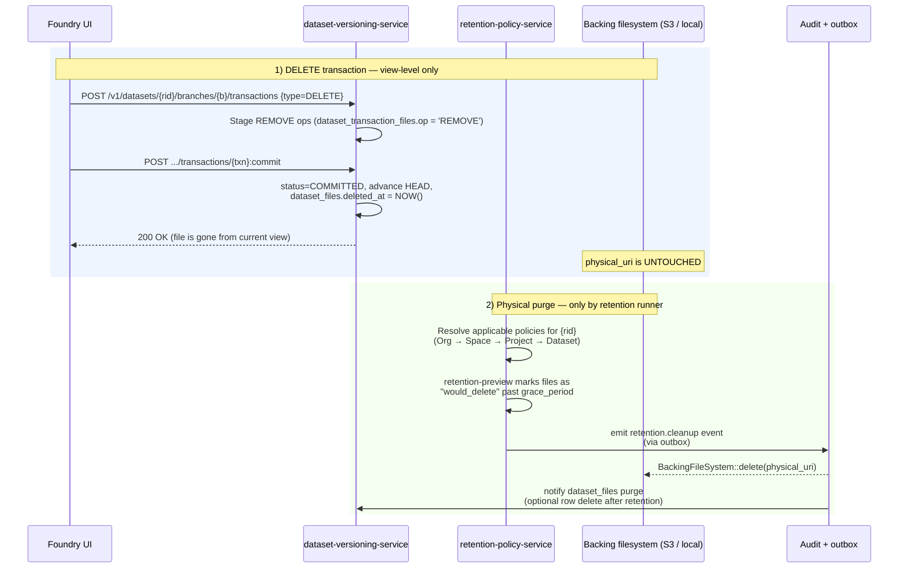

# dataset-versioning-service

Owns the Foundry dataset versioning surface — branches, transactions,
views, schemas (per view), file mapping, and dataset-side retention
metadata. Pairs with `retention-policy-service` (P4) for the
physical-purge half of the lifecycle.

## DELETE transactions vs physical purge

Foundry's `Datasets.md` § "Retention" pins the contract:

> Note that committing a `DELETE` transaction does not delete the
> underlying file from the backing file system — it simply removes the
> file reference from the dataset view.
>
> Since a `DELETE` transaction does not actually remove older data from
> the backing filesystem, you can use Retention policies to remove data
> in transactions which are no longer needed.

That contract splits cleanly across two services. This README documents
who does what and how the two paths hand off.

### Invariants

* `commit_transaction` for `tx_type='DELETE'` MUST NOT call
  `BackingFileSystem::delete`. The post-commit DB state is the only
  observable change.
* `dataset_files.deleted_at` flips to `NOW()` for every REMOVE op
  consumed by the trigger
  `trg_dataset_files_from_committed_txn` (P3 migration).
* `retention-policy-service` is the *only* service authorised to issue
  physical deletes. The cleanup path is asynchronous and gated by the
  policy's `grace_period_minutes`. Retention-driven physical deletes
  emit a `retention.cleanup` audit event via the outbox.
* The ABORTED-transaction system policy
  (`DELETE_ABORTED_TRANSACTIONS`, seeded by
  `migrations/20260502130000_retention_system_policies.sql`) is the
  one exception that runs unattended — and it still goes through the
  retention runner, never directly through DVS.

### Endpoint cheat-sheet

| Path                                               | Owner            | Effect                                     |
| -------------------------------------------------- | ---------------- | ------------------------------------------ |
| `POST .../transactions {type=DELETE}` + `:commit`  | DVS              | View-level removal only                    |
| `GET  /v1/datasets/{rid}/files`                    | DVS              | Lists active + soft-deleted files          |
| `GET  /v1/datasets/{rid}/applicable-policies`      | retention-policy | Inheritance + winner                       |
| `GET  /v1/datasets/{rid}/retention-preview`        | retention-policy | Simulates upcoming purge                   |
| `POST /v1/jobs` (retention-policy-service)         | retention-policy | Triggers the *physical* purge              |

### See also

* `services/retention-policy-service/` — policy CRUD, applicable
  policies resolver, retention preview, runner.
* `services/dataset-versioning-service/migrations/20260503000002_dataset_files.sql`
  — the trigger that flips `deleted_at` on REMOVE ops.
* `docs_original_palantir_foundry/.../Core concepts/Datasets.md`
  § "Retention" — the upstream contract this contract mirrors.

## Branching parity (D1.1.4 — 5/5)

This service owns the Foundry dataset-branching surface
(_Branching.md_ § "Dataset branches" + § "Branches in builds" inputs).
Every section below maps doc claims to code paths.

| Section | Claim | Code |
|---------|-------|------|
| Dataset branches | Branches are pointers to transactions | `dataset_branches.head_transaction_id` ([init migration](migrations/20260501000001_versioning_init.sql)) |
| Dataset branches | One open transaction per branch | partial unique index `uq_dataset_transactions_one_open_per_branch` |
| Dataset branches | Create child from branch / from transaction / as_root | [`BranchSource` in `handlers/foundry.rs`](src/handlers/foundry.rs) |
| Dataset branches | Re-parenting changes ancestry only | [`runtime::reparent_branch`](src/storage/runtime.rs) |
| Dataset branches | Delete preserves transactions (soft delete) | [`delete_branch` + `preview_delete_branch`](src/handlers/foundry.rs) |
| Dataset branches | Ancestry walk | `GET /branches/{branch}/ancestry` + [`list_branch_ancestry`](src/storage/runtime.rs) |
| Dataset branches | Fallback chain per branch | `dataset_branches.fallback_chain TEXT[]` + `dataset_branch_fallbacks` |
| Branches in builds | View-at-time / View-at-transaction | `GET /views/at?ts=` + `GET /views/at?transaction_id=` |
| Branches in builds | Branch comparison (LCA, conflicts) | [`handlers/compare.rs`](src/handlers/compare.rs) — `GET /branches/compare?base=&compare=` |
| Branch retention | INHERITED → walks up parent | [`domain/retention.rs`](src/domain/retention.rs) |
| Branch retention | TTL_DAYS archives stale branches | [`domain/retention_worker.rs`](src/domain/retention_worker.rs) |
| Branch retention | Manual override + restore in grace window | `PATCH /retention` + `POST :restore` |
| Branch security | Markings inheritance snapshot at creation | `branch_markings_snapshot` table + [`domain/branch_markings.rs`](src/domain/branch_markings.rs) |
| Branch security | Late-added parent markings DO NOT propagate | [test](tests/branch_markings_snapshot_at_creation.rs) |
| Branch security | Effective = explicit ∪ inherited | `BranchMarkingsView::from_rows` |
| Lifecycle / Audit | Outbox event per branch action | [`domain/branch_events.rs`](src/domain/branch_events.rs) → `foundry.branch.events.v1` |

For the cross-plane companion (datasets ↔ pipelines ↔ ontology) see
[`services/global-branch-service/README.md`](../global-branch-service/README.md)
and [ADR-0033](../../docs/architecture/adr/ADR-0033-branching-foundry-parity.md).

## Datasets parity (D1.1.1 — 5/5)

The full Datasets surface lands across this service plus
[`dataset-quality-service`](../dataset-quality-service/) and
[`apps/web/src/lib/components/dataset/`](../../apps/web/src/lib/components/dataset/).
Every section below maps Foundry doc claims to code paths.

| Section | Claim | Code |
|---------|-------|------|
| Schema | Schemas are metadata on a *dataset view*, one row per content hash | `dataset_view_schemas` ([migration](migrations/20260501000003_view_schema.sql)) + [`handlers/schema.rs`](src/handlers/schema.rs) |
| Schema | Composite types: STRUCT / ARRAY / MAP / DECIMAL | [`SchemaPanel.svelte`](../../apps/web/src/lib/components/dataset/details/SchemaPanel.svelte) |
| Data preview | File-list views with file-format dispatch | [`handlers/preview.rs`](src/handlers/preview.rs) — Parquet, CSV, Avro, JSON-Lines |
| Backing filesystem | `logical_path → physical_path` mapping per dataset | `dataset_files` + [`storage_abstraction::backing_fs`](../../libs/storage-abstraction/src/backing_fs/) |
| Backing filesystem | Presigned download / upload URLs | [`handlers/files.rs`](src/handlers/files.rs) — `GET /files/{id}/download` (302) + `POST /transactions/{txn}/files` |
| Files tab | View-effective listing | [`FilesTab.svelte`](../../apps/web/src/lib/components/dataset/details/FilesTab.svelte) + `GET /files` |
| History | Transactions: SNAPSHOT / APPEND / UPDATE / DELETE | `dataset_transactions.tx_type` + [`transactional::TransactionalDatasetWriter`](src/storage/transactional.rs) |
| History | Open / commit / abort flow | `POST /transactions/{txn}:commit\|:abort` |
| History | View-at-time / view-at-transaction | `GET /views/at?ts=` + `GET /views/at?transaction_id=` |
| Retention | Per-branch retention with INHERITED resolution | [`domain/retention.rs`](src/domain/retention.rs) |
| Retention | Applicable policies + retention preview | `GET /datasets/{rid}/applicable-policies` + `GET /datasets/{rid}/retention-preview` |
| Compare | Side-by-side compare against another dataset/view | [`handlers/compare.rs`](src/handlers/compare.rs) + [`CompareTab.svelte`](../../apps/web/src/lib/components/dataset/CompareTab.svelte) |
| Open in… | Marketplace + downstream tool launchers | [`PublishToMarketplaceModal.svelte`](../../apps/web/src/lib/components/dataset/PublishToMarketplaceModal.svelte) |
| Data Health | Six-card dashboard self-fetched from `/health` | [`QualityDashboard.svelte`](../../apps/web/src/lib/components/dataset/QualityDashboard.svelte) |
| Data Health | `compute_health(rid)` — freshness, drift, txn rate, build status | [`dataset-quality-service/src/domain/health.rs`](../dataset-quality-service/src/domain/health.rs) |
| Health checks | Policy types: freshness / txn_failure_rate / schema_drift / row_drop | `dataset_health_policies` ([migration](../dataset-quality-service/migrations/20260503000004_dataset_health.sql)) |
| Application reference | Cursor pagination — `?cursor=&limit=` returning `{ data, next_cursor, has_more }` | [`handlers/conformance.rs::Page`](src/handlers/conformance.rs) wired into `list_versions`, `list_branches`, `list_transactions` |
| Application reference | ETag / 304 Not Modified on resource GETs | [`handlers/conformance.rs::json_with_etag`](src/handlers/conformance.rs) wired into `get_branch`, `get_transaction` |
| Application reference | 207 Multi-Status batch responses | `POST /v1/datasets/{rid}/transactions:batchGet` + [`handlers/conformance.rs::batch_response`](src/handlers/conformance.rs) |
| Application reference | Unified error envelope `{ code, message, details, request_id }` | [`handlers/conformance.rs::ErrorEnvelope`](src/handlers/conformance.rs) |
| Observability | Per-dataset Prometheus metrics | [`dataset-quality-service/src/metrics.rs`](../dataset-quality-service/src/metrics.rs) — `dataset_freshness_seconds`, `dataset_row_count`, `dataset_txn_failures_total` |

See [ADR-0034](../../docs/architecture/adr/ADR-0034-datasets-foundry-parity.md)
for the full design rationale and the mermaid diagram of the
quality-service compute path.
