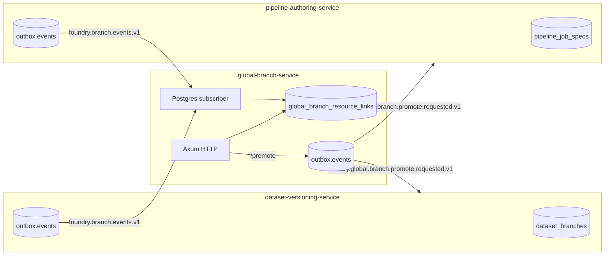

# global-branch-service

Cross-plane branch coordination — the OpenFoundry equivalent of
Foundry's _Global Branching application_ + _Branch taskbar_.

A *global branch* names a workstream that spans datasets, pipelines,
ontology, and code repos. Each plane keeps owning its local branches;
this service stores the cross-plane label, the resource-link map,
and the outbox events that coordinate promotions.

## Architecture



## HTTP surface

| Method + path | Description |
|---------------|-------------|
| `POST /v1/global-branches` | Create a global branch (name, optional parent). |
| `GET /v1/global-branches` | List every global branch. |
| `GET /v1/global-branches/{id}` | Summary: link counts, drifted/archived counters. |
| `POST /v1/global-branches/{id}/links` | Link a local branch (`{ resource_type, resource_rid, branch_rid }`). |
| `GET /v1/global-branches/{id}/resources` | Tabular link list with per-resource sync status. |
| `POST /v1/global-branches/{id}/promote` | Enqueue `global.branch.promote.requested.v1`. |
| `GET /healthz` | Readiness probe. |

## Subscriber semantics

[`PostgresSubscriber`](src/global/subscriber.rs) interprets the
shared `foundry.branch.events.v1` topic:

| Event | Effect |
|-------|--------|
| `dataset.branch.created.v1` (with `labels.global_branch=<rid>`) | Create the link as `in_sync`. |
| `dataset.branch.archived.v1` | Set link `status = archived`. |
| `dataset.branch.restored.v1` | Set link `status = in_sync`. |
| `dataset.branch.reparented.v1` | Set link `status = drifted`. |
| `dataset.branch.markings.updated.v1` | Set link `status = drifted`. |
| Other event types | Logged at `debug`, no link mutation. |

Drift triggers the UI's amber badge so an operator can decide whether
to promote, manually re-link, or accept the divergence. Promotion
itself is just an event — each plane consumes it according to its
own rules (no service performs the cross-plane mutation directly).

## Deferred work

* Workshop rebase / conflict-resolution UX — the LCA + conflicting-files
  shape is already exposed by `dataset-versioning-service`'s
  `GET /branches/compare`; the resolver UX lives in the Workshop plane.
* `current_branch()` / `branching_functions` (Global Branching § "Branching
  functions") — tracked separately as part of the Branching SDK work.

## Tests

```bash
# Unit tests:
cargo test -p global-branch-service --lib

# Postgres-gated integration tests (testcontainers):
cargo test -p global-branch-service --include-ignored
```

See [ADR-0033 — Branching: Foundry parity](../../docs/architecture/adr/ADR-0033-branching-foundry-parity.md)
for the full parity matrix and design rationale.
