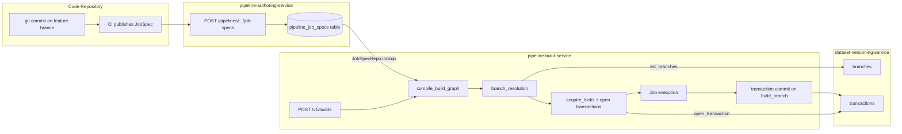

# pipeline-build-service

Owns the **Builds** application surface: per-pipeline run lifecycle,
the global Builds queue, the formal `/v1/builds` Foundry-aligned
lifecycle, and the **branch-aware build resolution** described in
[/docs/foundry/data-integration/branching/ §
"Branches in builds"](../../docs_original_palantir_foundry/foundry-docs/Data%20connectivity%20%26%20integration/Core%20concepts/Branching.md).

## Foundry contract — Code Repo commit → committed transaction



The five lifecycle steps line up 1:1 with the Foundry doc:

1. **Code Repo publishes JobSpecs** to `pipeline-authoring-service`
   (`POST /pipelines/{rid}/branches/{branch}/job-specs`). The publish
   path is **idempotent** by content hash: republishing the same
   JobSpec returns `new_version: false`; republishing with changed
   `inputs` or `job_spec_json` bumps `version`.

2. **`compile_build_graph`** (in [`domain/job_graph.rs`](src/domain/job_graph.rs))
   walks the configured `[build_branch, ...job_spec_fallback]` chain
   per output dataset and pulls the JobSpec from
   `pipeline-authoring-service`. It then expands transitively, detects
   cycles (Kahn), and returns a topologically-ordered `JobGraph`.

3. **`branch_resolution`** (in [`domain/branch_resolution.rs`](src/domain/branch_resolution.rs))
   resolves each input dataset's branch by walking the per-input
   `fallback_chain` declared on the JobSpec, falling back to
   `develop`/`master`/etc. as configured. It also runs
   `assert_chain_ancestry_compatible` so a chain that crosses a
   parent boundary that doesn't exist on the dataset is rejected with
   `ResolveError::IncompatibleAncestry`.

4. **`acquire_locks`** opens a NEW transaction on each output dataset
   (always on the build branch — see *Build branch guarantees* below)
   and inserts a row into `build_input_locks`. The PRIMARY KEY on
   `output_dataset_rid` is the lock primitive — concurrent builds
   targeting the same output collide on insert.

5. **Job execution** runs the JobSpecs in topological order and
   commits each output transaction via
   `dataset-versioning-service`. The build branch is the only branch
   modified during the run.

## Build branch guarantees

Encoded as pure assertions in [`domain/run_guarantees.rs`](src/domain/run_guarantees.rs):

* **`assert_transaction_targets_build_branch(build, target)`** — every
  transaction opened by a build must target the build branch. Drift
  to any other branch returns `GuaranteeError::TransactionOnWrongBranch`.
* **`assert_input_dataset_not_branched(build_id, graph, branched)`** —
  a dataset that appears *only* as input in the compiled `JobGraph`
  cannot be the target of `branch.create` in the same build run.
* **`assert_chain_ancestry_compatible(rid, build, chain, ancestry)`**
  (in `branch_resolution`) — the fallback chain must be a sub-sequence
  of the dataset's recorded branch ancestry. Maps to the doc line
  *"Build resolution only succeeds if the specified branch fallback
  sequence is compatible with the branch ancestries in the involved
  datasets."*

## Endpoints

* `POST /api/v1/data-integration/pipelines/{id}/runs` — legacy run
  trigger (Foundry "Build dataset" button).
* `POST /api/v1/data-integration/pipelines/{rid}/dry-run-resolve` —
  pure simulation of `compile_build_graph + branch_resolution` without
  acquiring locks or opening transactions. Used by the Pipeline
  Builder UI's "Resolved build plan" preview.
* `POST /v1/builds` — Foundry-aligned Build submission with
  `BuildState` lifecycle.

## Metrics

`build_resolutions_total{outcome}` — labelled by
`ok | missing_spec | incompatible_ancestry | cycle`. Pre-touched at
boot so dashboards render before the first build.

Other metrics: `build_state_total{state}`, `jobs_in_state{state}`,
`build_resolution_duration_seconds`,
`build_lock_acquisition_duration_seconds`.

## Tests

```bash
# Pure-domain tests (no Docker required):
cargo test -p pipeline-build-service

# Full lifecycle, including Postgres-backed scenarios:
cargo test -p pipeline-authoring-service -p pipeline-build-service \
    --include-ignored
```

Notable suites:

* `compile_build_graph_falls_back_to_master.rs` — the doc example A,
  B, C with `feature → master` fallback chain.
* `build_resolution_incompatible_ancestry_fails.rs` — guarantees the
  ancestry-compatibility check is enforced.
* `build_does_not_create_branch_on_input_dataset.rs` — `branch.create`
  on input-only datasets is rejected.
* `build_does_not_modify_other_branches.rs` — every transaction opened
  by a build lands on the build branch.

---

## Foundry parity matrix (D1.1.5 closure — 5/5)

| Foundry section / control | OpenFoundry artefact | Status |
| --- | --- | --- |
| § Builds — overview | `handlers::builds_v1` (`/v1/builds`), [routes/builds](../../apps/web/src/routes/builds) | ✅ |
| § Jobs and JobSpecs | `domain::build_resolution::JobSpec`, `domain::runners::*` | ✅ |
| § Job states (`WAITING`/.../`COMPLETED`) | `models::job::JobState`, `domain::job_lifecycle::is_valid_transition` | ✅ |
| § Build resolution (cycles, locks, queue) | `domain::build_resolution::resolve_build` | ✅ |
| § Job execution (parallelism, cascade) | `domain::build_executor::{execute_build, compute_cascade}` | ✅ |
| § Staleness + force build | `domain::staleness::is_fresh`, `Build.force_build` | ✅ |
| § Live logs (color, pause, JSON, 10s delay) | `domain::logs::*`, `LiveLogViewer.svelte` | ✅ |
| § Branching in builds | `domain::branch_resolution::{resolve_input,resolve_output}` | ✅ |
| Logic kind: Sync (Data Connection) | `domain::runners::sync` → `connector-management-service` | ✅ |
| Logic kind: Transform | `domain::runners::transform` (engine integration deferred) | 🟡 |
| Logic kind: Health check | `domain::runners::health_check` → `dataset-quality-service` | ✅ |
| Logic kind: Analytical | `domain::runners::analytical` | ✅ |
| Logic kind: Export | `domain::runners::export` | ✅ |
| InputSpec view filter (4 selector kinds) | `domain::runners::resolver::resolve_view_filters` | ✅ |
| Multi-output atomicity | `migrations/20260504000051_multi_output.sql`, `domain::build_executor` commit/abort path | ✅ |
| Application reference § Builds | `apps/web/src/routes/builds/+page.svelte`, `[rid]/+page.svelte` | ✅ |
| Outbox `foundry.build.events.v1` | `domain::build_events` | ✅ |
| Prometheus metrics | `domain::metrics` (`build_state_total`, `build_duration_seconds`, `build_jobs_total{state,kind}`, `build_logs_emitted_total`, `live_log_subscribers`, `build_queue_depth`) | ✅ |

Decisions captured in [ADR-0036 Builds: Foundry parity](../../docs/architecture/adr/ADR-0036-builds-foundry-parity.md):

1. Builds queue on input contention (BUILD_QUEUED).
2. The 10-second live-log delay is intentional (Foundry-doc parity).
3. Staleness signature = (`canonical_logic_hash`, `input_signature`).
4. Failure cascade defaults to `DEPENDENT_ONLY`.
5. Multi-output atomicity is an executor invariant — partial commit
   marks the job FAILED and aborts the rest.

### Cross-app deep-links (D1.1.5 5/5)

| Component | Mount point | Purpose |
| --- | --- | --- |
| [`StateBadge.svelte`](../../apps/web/src/lib/components/builds/StateBadge.svelte) | Reused across `/builds`, dataset detail, dataset-builds block | Pulsing colour-coded BuildState/JobState pill |
| [`DatasetBuildsBlock.svelte`](../../apps/web/src/lib/components/builds/DatasetBuildsBlock.svelte) | Drop into `routes/datasets/[id]/+page.svelte` (Quality dashboard or sidebar) | "Recent builds touching this dataset" list with deep-link to `/builds/{rid}` |
| [`CommandPalette.svelte`](../../apps/web/src/lib/components/ui/CommandPalette.svelte) | Mounted in `routes/+layout.svelte` | `Ctrl+K` palette with **Open builds** / **Run build** / **View build {rid}** commands |
| `Sidebar.svelte` "Builds" entry | Primary nav | Direct link to `/builds` |

